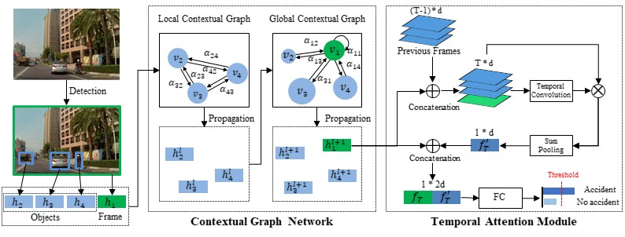

# Accident Anticipation

## Introduction
Source code of paper 'Novel Contextual Graph Network with Attention for Accident Anticipation in Video'.

## Pipeine

## Reference
* **Anticipating Traffic Accidents with Adaptive Loss and Large-scale Incident DB** [[Paper]](https://arxiv.org/pdf/1804.02675.pdf)
  * T. Suzuki, H. Kataoka, Y. Aoki, Y. Satoh, CVPR 2018.
* **Agent-Centric Risk Assessment: Accident Anticipation and Risky Region Localization** [[Paper]](http://openaccess.thecvf.com/content_cvpr_2017/papers/Zeng_Agent-Centric_Risk_Assessment_CVPR_2017_paper.pdf)
  * K. H. Zeng, S. H. Chou, F. H. Chan, J. C. Niebles, M. Sun, CVPR 2017.
* **Anticipating accidents in dashcam videos** [[Paper]](https://yuxng.github.io/chan_accv16.pdf) [[Code]](https://github.com/smallcorgi/Anticipating-Accidents) [[Project]](https://aliensunmin.github.io/project/dashcam/)
  * F. H. Chan, Y. T. Chen, Y. Xiang, M. Sun, ACCV 2016.
